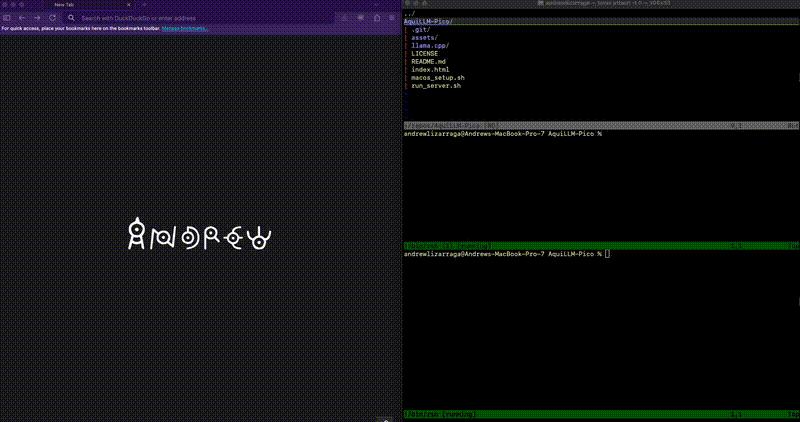

## AquiLLM-Pico

This repository serves as a local-only LLM chat session and will serve as the base for research chat session in environments 
where cloud access is not permissible.

### About

The current chat is very minimal, it uses llama.cpp as the backend and a Qwen/Qwen3-4B-GGUF model under the hood.
Some missing features that will be added later:

1. RAG is not implemented (but there is a very minimal context and chat compression to keep single chat sessions coherent).
2. There is no document injestion or OCR.
1. The chat is setup for MacOS and the project will expand to other OS's later.

### Installation
We assume you have python3.14 and cmake (4.2.0) installed on your system.

### MacOS
Run the following to fetch llama.cpp repo and compile with the metal shaders, it then fetches Qwen3-4B-GGUF and installs it on your system. Be sure to have at least 3GB of space available for this.

```
bash macos_setup.sh
```

### Linux

```
bash linux_ubuntu_setup.sh
```

### Web Browser Session
```
bash run_server.sh

open index.html
```

### Command Line Interface

```
bash run_cli.sh
```

### Example Session




